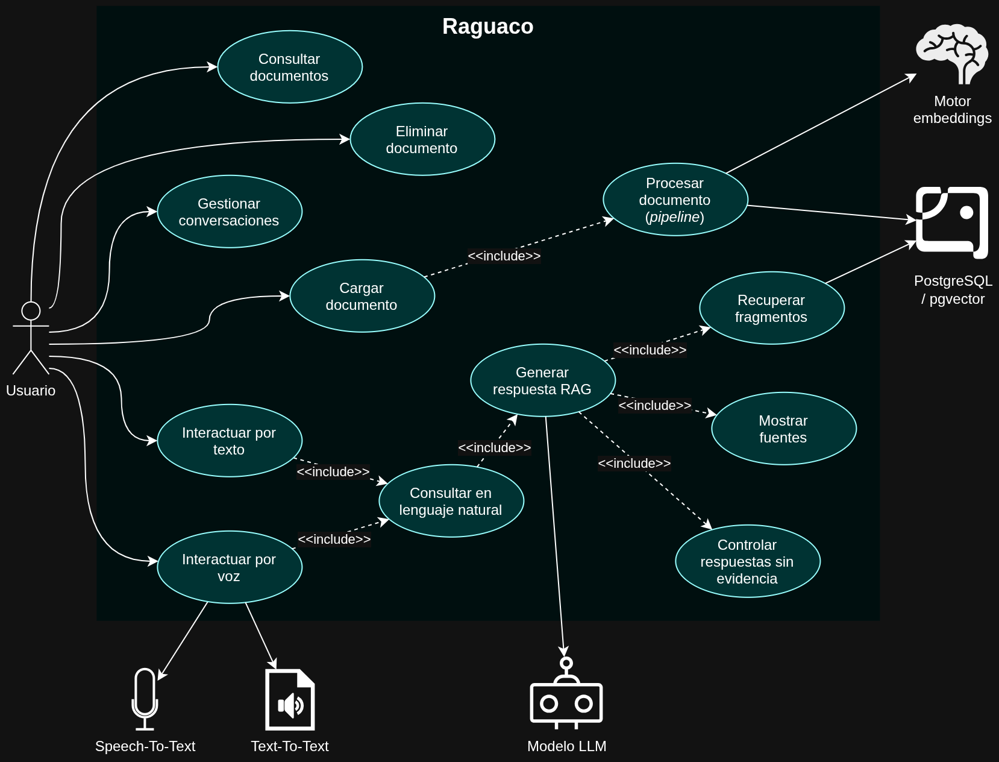
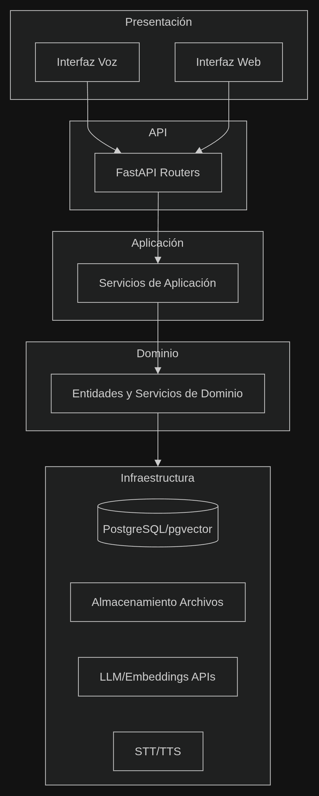
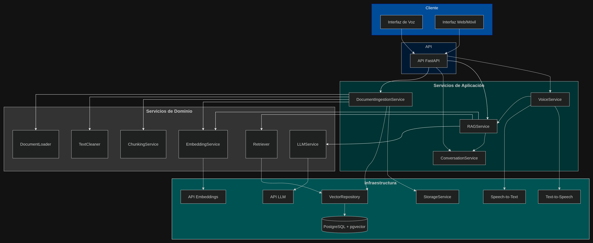
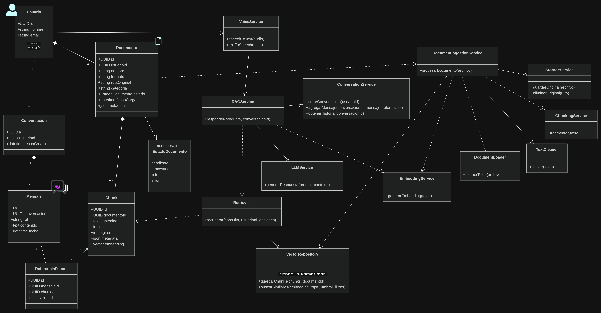
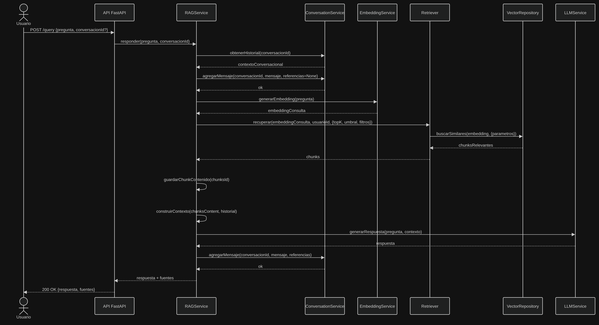
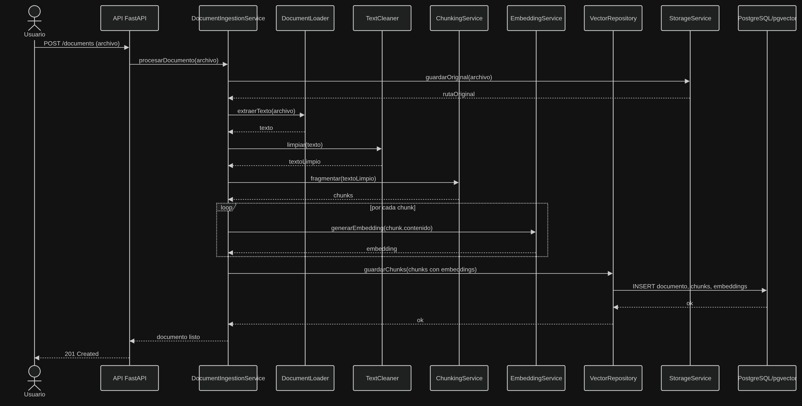
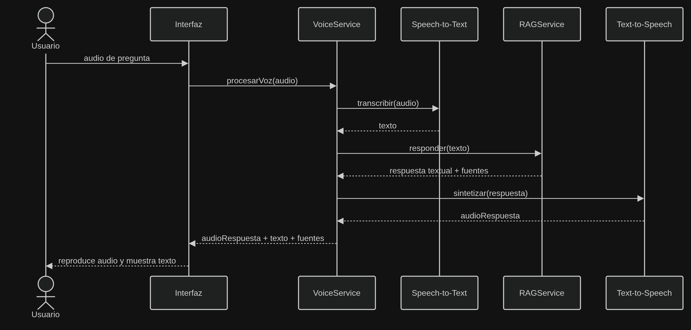

# Diagramas

En esta sección se recopilan los diagramas UML y de arquitectura del sistema **raguaco**.

## Casos de uso



## Arquitectura



## Componentes



## Diagrama de clases



## Entidad-Relación


## Diagramas de secuencia

### Consulta con lenguaje natural (Ask with PNL)



### ETL de documentos



### Interacción por voz



---

## Estructura de rutas

A continuación se presenta el orden de carpetas y archivos que tendrá la aplicación:

```text
rag_app/
├── app/
│   ├── main.py
│   ├── api/
│   │   ├── deps.py
│   │   └── routes/
│   │       ├── documents.py
│   │       ├── queries.py
│   │       ├── conversations.py
│   │       └── voice.py
│   ├── core/
│   │   ├── config.py
│   │   ├── logging.py
│   │   └── exceptions.py
│   ├── domain/
│   │   ├── models/
│   │   │   ├── usuario.py
│   │   │   ├── documento.py
│   │   │   ├── chunk.py
│   │   │   ├── conversacion.py
│   │   │   └── mensaje.py
│   │   ├── schemas/
│   │   └── services/
│   │       ├── document_ingestion_service.py
│   │       ├── rag_service.py
│   │       ├── conversation_service.py
│   │       └── voice_service.py
│   ├── infrastructure/
│   │   ├── db/
│   │   │   ├── session.py
│   │   │   └── repositories/
│   │   ├── vector/
│   │   │   └── pgvector_repository.py
│   │   ├── storage/
│   │   │   └── local_storage.py
│   │   ├── llm/
│   │   │   └── llm_service.py
│   │   ├── embeddings/
│   │   │   └── embedding_service.py
│   │   └── loaders/
│   │       ├── document_loader.py
│   │       ├── text_cleaner.py
│   │       └── chunking_service.py
│   └── tests/
│── frontend/
├── migrations/
├── scripts/
├── docker/
├── requirements.txt
├── .env.example
└── README.md
```
